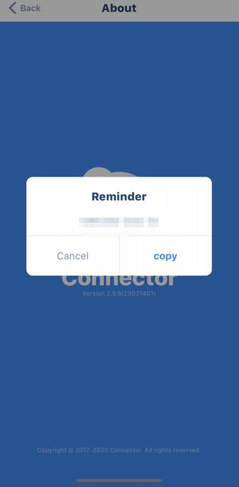

# connector-local

Python library for interfacing with Connector Shades

This library allows you to control Connector Shades.
This library is primarly writen to be used with HomeAssistant but can also be used stand alone.


## Installation

Use pip:

```$ pip install connector_local```


## Retrieving Key

The Connector Shades API uses a 16 character key that can be retrieved from the official "Connector Shades" app for [Ios](https://itunes.apple.com/cn/app/connector/id1344058317?mt=8) or [Android](https://play.google.com/store/apps/details?id=com.smarthome.app.connector).
Open the app, click the button in the upper left corner to expand the page, then click the setting button in the upper left corner to enter the "Settings page", click the About option to enter the "About page",Please quickly tap this "Connector Shades About" page 5 times, a popup will apear that gives you the key.





## Usage

For creation of a device you could use the following lines of codes (using a correct IP of the gateway and Key retrieved from the App)

```python
from connector_local import ConnectorHub

connector = ConnectorHub(ip="192.168.31.100", key="12ab345c-d67e-8f")
# If you want to add multiple HUB, Please use & as separator
connector = ConnectorHub(ip="192.168.31.100&192.168.31.101", key="12ab345c-d67e-8f")
```

When the connector instance is created, you need to actively open the receiving, because the connector is based on local UDP communication.

```python
connector.start_receive_data()
```

After opening UDP reception, you need to actively wait for about 3 seconds (it takes a little time to query the device and update the device status), and then query the device list

```python
connector.device_list()
```

Some example code that will print the information of the gateway and all connected blinds:

```
>>> from connector_local import ConnectorHub
>>> connector = ConnectorHub(ip="192.168.31.100", key="12ab345c-d67e-8f")
>>> connector.start_receive_data()
>>> hubs = connector.device_list()
>>> print(hubs)
>>> {'a4cf1216c014': <__main__.Hub object at 0x0000022012E6D610>}
```

If you want to get the sub-device under HUB, you can get it through hub.blinds

```python
>>> hub = hubs["a4cf1216c014"]
>>> blinds_list = hub.blinds
>>> print(blinds_list)
>>> {'a4cf1216c014000a': <__main__.OneWayBlind object at 0x00000235DA92D610>, 'a4cf1216c014000d': <__main__.OneWayBlind object at 0x00000235DA92DA90>, 'a4cf1216c014000e': <__main__.TwoWayBlind object at 0x00000235DA92D6A0>, 'a4cf1216c0140015': <__main__.TwoWayBlind object at 0x00000235DA92D970>, 'a4cf1216c0140016': <__main__.TwoWayBlind object at 0x00000235DA92D760>, 'a4cf1216c0140017': <__main__.TwoWayBlind object at 0x00000235DA92D8E0>}
```

OneWayBlind supports up stop and down, 

TwoWayBlind supports up stop down and percentage control

```python
blinds = blinds_list["a4cf1216c014000e"]
# open blinds
blinds.open()
# stop blinds
blinds.stop()
# close blinds
blinds.close()
# Control blinds to 50% (0% is open, 100% is close)
blinds.target_position(percent = 50)
# Control blinds to 90 degrees (Angle control range is 0 to 180 degrees)
blinds.target_angle(angle = 90)

```

## ConnectorHub

| method / property              | arguments | argument type | explanation                                                  |
| ------------------------------ | --------- | ------------- | ------------------------------------------------------------ |
| connector.start_receive_data() | /         | /             | Join UDP multicast and create threads.                       |
| connector.close_receive_data() | /         | /             | Close receive thread.                                        |
| connector.device_list()        | /         | /             | Return the device list.                                      |
| connector.is_connected         | /         | /             | Return the connect status                                    |
| connector.error_code           | /         | /             | If the connection status is False, you need to check the error code.         1000 :connection succeeded        1001: key is wrong                                1002: port is occupied |


## Hub

| method / property   | arguments | argument type | explanation                                          |
| ------------------- | --------- | ------------- | ---------------------------------------------------- |
| hub.blinds_list     | /         | /             | Return all blinds.                                   |
| hub.hub_version     | /         | /             | Return hub version.                                  |
| hub.hub_mac         | /         | /             | Return hub mac.                                      |
| hub.devicetype      | /         | /             | Return device type.                                  |
| hub.update_blinds() | /         | /             | Update the status of all Two Way Blind under the hub |


## OneWayBlind

| method / property    | arguments | argument type | explanation                     |
| -------------------- | --------- | ------------- | ------------------------------- |
| blinds.open()        | /         | /             | open blinds                     |
| blinds.close()       | /         | /             | close blinds                    |
| blinds.stop()        | /         | /             | stop blinds                     |
| blinds.mac           | /         | /             | return the blinds mac           |
| blinds.device_type   | /         | /             | return the blinds device type   |
| blinds.type          | /         | /             | return the blinds type          |
| blinds.wireless_mode | /         | /             | return the blinds wireless mode |


## TwoWayBlind

| method / property                   | arguments | argument type | explanation                            |
| ----------------------------------- | --------- | ------------- | -------------------------------------- |
| blinds.open()                       | /         | /             | open blinds                            |
| blinds.close()                      | /         | /             | close blinds                           |
| blinds.stop()                       | /         | /             | stop blinds                            |
| blinds.target_position(percent=100) | percent   | int (0-100)   | Percentage control.                    |
| blinds.target_angle(angle = 90)     | angle     | int (0-180)   | Angle control.                         |
| blinds.mac                          | /         | /             | return the blinds mac                  |
| blinds.device_type                  | /         | /             | return the blinds device type          |
| blinds.type                         | /         | /             | return the blinds type                 |
| blinds.wireless_mode                | /         | /             | return the blinds wireless mode        |
| blinds.update_state()               | /         | /             | update the position of the blind.      |
| blinds.isClosed                     | /         | /             | return if the cover is closed or not.  |
| blinds.position                     | /         | /             | return current position of the blinds. |

## Attribute Value Explanation

| wireless mode | explanation                      |
| ------------- | -------------------------------- |
| 0             | Uni-direction                    |
| 1             | Bi-direction                     |
| 2             | Bi-direction (mechanical limits) |
| 3             | Wi-Fi                            |
| 4             | Bi-direction(virtual percentage) |
| 5             | Others                           |

| type | explanation         |
| ---- | ------------------- |
| 1    | Roller Blinds       |
| 2    | Venetian Blinds     |
| 3    | Roman Blinds        |
| 4    | Honeycomb Blinds    |
| 5    | Shangri-La Blinds   |
| 6    | Roller Shutter      |
| 7    | Roller Gate         |
| 8    | Awning              |
| 10   | Day&night Blinds    |
| 11   | Dimming Blinds      |
| 12   | Curtain             |
| 13   | Curtain(Open Left)  |
| 14   | Curtain(Open Right) |

| deviceType | explanation         |
| ---------- | ------------------- |
| 02000001   | Wi-Fi Bridge        |
| 10000000   | 433Mhz radio motor  |
| 22000000   | Wi-Fi Curtain       |
| 22000002   | Wi-Fi tubular motor |
| 22000005   | Wi-Fi receiver      |

